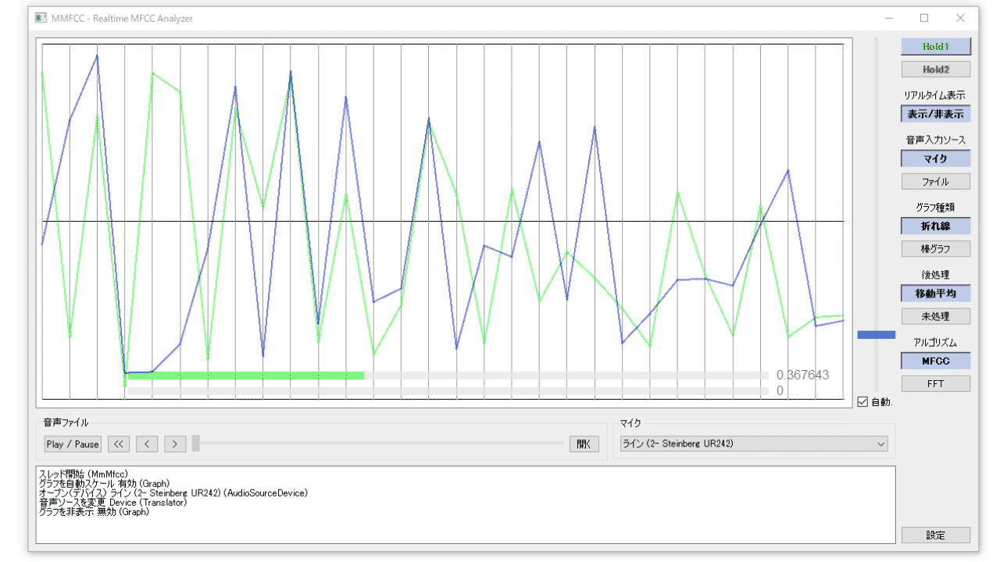

# MMMFCC 
MFCC（メル周波数ケプストラム係数）リアルタイムアナライザー

MFCC (Mel-frequency cepstral coefficients) Realtime Analyzer

## 概要
* MFCCは音声認識などに使用される特徴量で、口の形とかそいう成分を音声から抽出したもの
* オーディオデバイス（マイク等）と音声ファイルからの入力に対応
* ケプストラムを固定して表示できるホールド機能
* ホールドしているケプストラムと、入力されている音声のケプストラムとの誤差（平均二乗誤差）を表示
* 自動スケーリング（ $ f(x) = \frac{x}{1 + |x|} $ を使用）
* 60fpsで動作可（検証環境：AMD A8-7600）

## 動作環境
* Windows
* その他未確認

## 開発環境

* Qt Creator (MSVC 2017)

## 使用ライブラリ

* Qt5
* compute-mfcc (D S Pavan Kumar)
    * https://github.com/dspavankumar/compute-mfcc

## ライセンス
GPL3